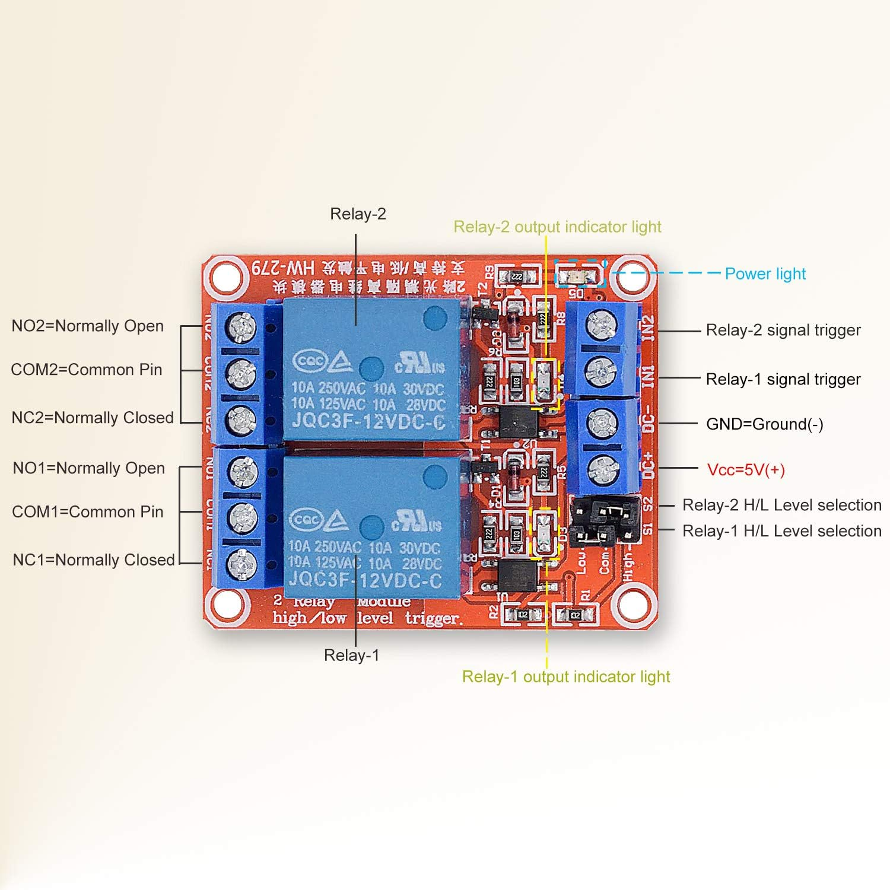

# Indiana Jones - Fertility Idol Altar
This is the code that connects the PN532 RFID reader, activates the linear actuator and can also communicate with other devices with RFM69 packet radio

Plan for all devices to run on Raspberry Pi Pico (RP2040) based boards with RFM69 packet radios, currently using:
Adafruit Feather RP2040 RFM69 Packet Radio (868 or 915 MHz) and allows for STEMMA QT expansion
- https://www.adafruit.com/product/5712
- Guide: https://learn.adafruit.com/feather-rp2040-rfm69

The project is designed to run under CircuitPython, but if memory issues, can consider using MicroPython with Thonny and tips below:
- In general, we will use Thonny to save files to the Pico and to edit code
- Guide: https://projects.raspberrypi.org/en/projects/getting-started-with-the-pico/0

For editing python code on the Pico, recommend using Thonny
- If using CircuitPython, no specific requirements with my preference for Thonny
- If using Micropython, recommend Thonny

RFID reader:
- PN532
  - Plan to use the SPI interface
- Can also use MF522 as backup if needed

PN532:
  - Example code from PN532 library page
    --> https://docs.circuitpython.org/projects/pn532/en/latest/examples.html
  - Example code for UART
    --> https://github.com/StevenSeagull1/raspbery_pico/tree/main
  - Example code for SPI
    --> https://stackoverflow.com/questions/73194125/select-apdu-command-on-raspberry-pi-pico-with-pn532-repond-nothing
  - Wiring for SPI:
    - https://forums.raspberrypi.com/viewtopic.php?t=320933
    - https://learn.adafruit.com/adafruit-pn532-rfid-nfc/python-circuitpython
    - MOSI = SPI TX (default for SPI0 on Pico is board.MOSI) and is MOSI on red PN532 board
    - MISO = SPI RX (default for SPI0 on Pico is board.MISO) and is MISO on red PN532 board
    - SCK = SPI SCK (default for SPI0 on Pico is board.SCK) and is SCK on red PN532 board
    - CSN = SPI CSN (any digital input pin, currently defaulting to board.D5) and is SS on red PN532 board
    - 3.3V
    - GND

RFM69 packet radio:
- https://learn.adafruit.com/feather-rp2040-rfm69/rfm69-radio-demo

Linear actuator
- Plan for either 6" or 12" stroke
- Typically is powered 12v
- Typically direction of movement (extend, retract) is controlled by a signal to the two wires.  This is best controlled with a 2 channel relay, see next section
- current one being used is 6" stroke
  - https://www.amazon.com/gp/product/B07RXQGJLT/ref=ppx_yo_dt_b_search_asin_title?ie=UTF8&th=1

2 channel relay with 3.3v input logic / trigger
- Useful general guide about relays:
- - https://core-electronics.com.au/guides/getting-started-with-relays-examples-with-raspberry-pi-pico/
- Need to make sure it is triggered by a 3.3v input
- I used two of these inexpensive 3v single channel relays
- - https://a.co/d/43FexUP
- Video about relay wiring for actutator: https://www.youtube.com/watch?v=hgSht52Mk54
- See pictures for wiring example and will want to set jumpers to LOW trigger input
- 
- 

Basic arrangement / wiring diagrams
- Pi Pico #1 -> the main altar and pedestal
  - runs altar_pn532.py which drives the PN532 RFID reader, controls linear actuator and sends commands to other devices with RFM69 packet radio
  - Plan to also drive small speaker to play sound file (presume mp3) of grinding rock as the altar pedestal moves up / down
    - Guide to mp3 playback on Pico: https://learn.adafruit.com/mp3-playback-rp2040/pico-mp3
  - Plan to add small vibration or piezo electric shaker for additional fun
    - https://www.adafruit.com/product/2305

- Pi Pico #2,... -> runs listen-act.py, which receives the RFID key tag string via RFM69 packet radio and can then perform actions based on this tag

-------------------------------------

Other libraries required:
- Need to use the current Adafruit Circuitpython bundle
  - Copy the folder "adafruit_pn532" to the "lib" folder on the CircuitPy drive  (.e. root / lib / "adafruit-pn523 folder")
  - Copy the "adafruit_rfm69.mpy" to the "lib" folder on the CircuitPy drive (i.e. root / lib / adafruit_rfm69.mpy)

---

  Other References:
  - https://learn.adafruit.com/circuitpython-on-raspberrypi-linux/spi-sensors-devices
    --> Info specifically on SPI bus
  - https://learn.adafruit.com/adafruit-pn532-rfid-nfc/python-circuitpython
    -->  Installing the PN532 libraries, wiring diagrams for the PN532 breakout board

--------------------------------------

Tips for use of Git / Github:
- Git commit -am “commit notes”
- Git push origin main   # pushes changes on pi’s to GitHub
- Git pull origin main  # pulls or gets files from Github to pi

- BIG CHANGES!!!!!
